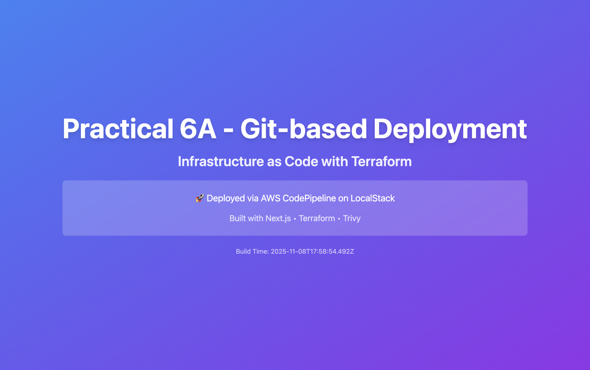
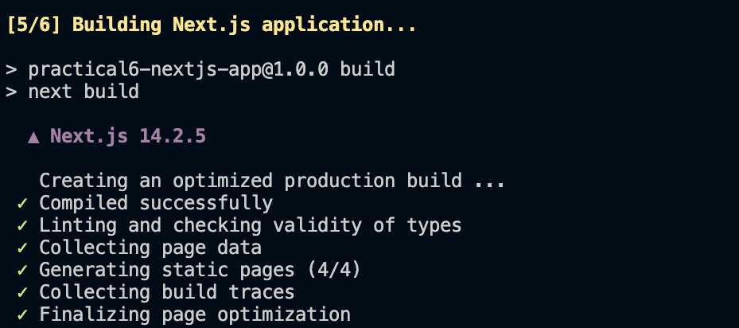
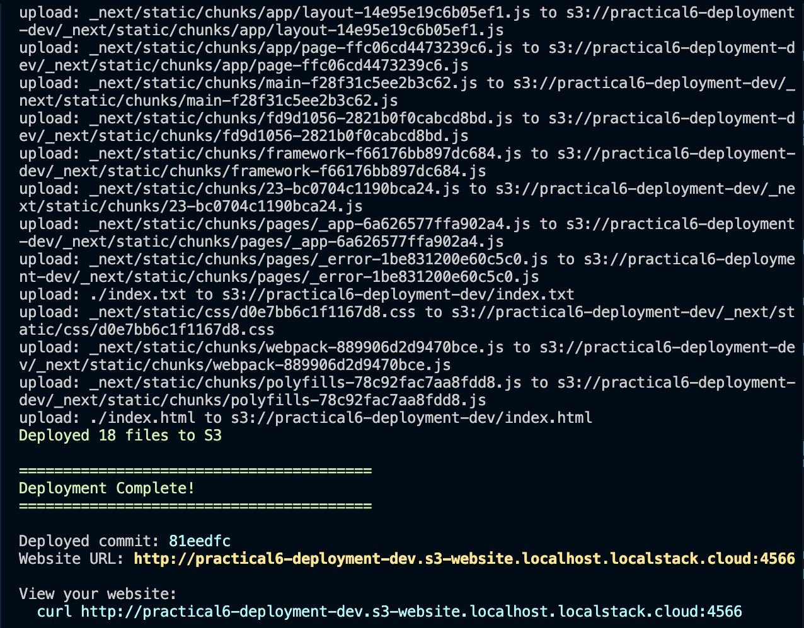
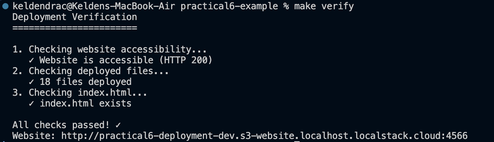

# Practical 6A: Git-based Deployment Workflow with GitHub and LocalStack

**Repository:** [practical6-nextjs-app](https://github.com/Wangpos/practical6-nextjs-app)

## 📋 Assignment Overview

This project demonstrates a complete Git-based deployment workflow implementation for Practical 6A. It extends Infrastructure as Code knowledge by implementing automated deployments from GitHub to LocalStack S3 using custom deployment scripts and CI/CD concepts.

### 🎯 Learning Objectives Achieved

- ✅ Created and managed a GitHub repository for infrastructure code
- ✅ Implemented a Git-based deployment workflow
- ✅ Automated deployments from GitHub to LocalStack S3
- ✅ Understood CI/CD concepts and deployment automation

### 🛠️ Technologies Used

- **Git & GitHub**: Version control and code hosting
- **Next.js**: React-based web application framework
- **Bash Scripts**: Deployment automation
- **LocalStack**: Local AWS emulator
- **Terraform**: Infrastructure as Code (from Practical 6)
- **Make**: Build automation and workflow management

## 🚀 Live Deployment

### Website Screenshot

# Practical 6A: Git-based Deployment Workflow with GitHub and LocalStack

**Repository:** `practical6-nextjs-app` — https://github.com/Wangpos/practical6-nextjs-app

## Abstract

This repository documents a reproducible, Git-driven deployment workflow developed for Practical 6A. The implementation demonstrates automated delivery of a statically exported Next.js site to an S3-compatible endpoint hosted by LocalStack, including verification and rollback mechanisms. The documentation adopts a formal structure to facilitate evaluation and replication.

## 1. Introduction

The aim of this work is to establish a deterministic pipeline that transfers versioned website artifacts from a GitHub repository to an S3-compatible object store emulated locally by LocalStack. The pipeline is designed for pedagogical clarity and practical reproducibility, highlighting principles of Infrastructure as Code (IaC) and basic CI/CD.

## 2. Materials and Technologies

- `git` and GitHub for version control and hosting
- Next.js for application development and static export
- LocalStack (S3) as a local AWS-compatible service
- Bash scripts and `Makefile` for orchestration
- Terraform for infrastructure definitions related to Practical 6

## 3. Methods

The deployment pipeline consists of the following high-level steps:

1. Source retrieval: clone or update the repository from GitHub
2. Build: install dependencies and produce a static export of the Next.js application
3. Deploy: synchronize the generated static assets with an S3 bucket in LocalStack
4. Verify: validate HTTP accessibility and asset correctness
5. Rollback (if required): redeploy an earlier commit using Git history

Scripts implementing the above steps are located in `practical6-example/scripts/` and include `deploy-from-github.sh`, `verify-deployment.sh`, `rollback.sh`, and `watch-and-deploy.sh`.

## 4. Implementation Evidence

The repository includes screenshots that document the deployment and verification process. All image references are retained here to preserve empirical evidence.

Website screenshot


Deployment process (examples)



Verification output


## 5. Reproducibility: Setup and Execution

Prerequisites

- LocalStack listening on port `4566`.
- Node.js and npm installed.
- Git configured with access to the GitHub repository.

Automated execution (recommended)

```bash
cd practical6-example
make deploy-github
make verify
```

Manual script sequence

```bash
export GITHUB_REPO="practical6-nextjs-app"
./scripts/deploy-from-github.sh
./scripts/verify-deployment.sh
./scripts/rollback.sh <COMMIT_SHA>
```

## 6. Project Structure

```
P6A/
├── app/                        # Next.js application source
├── image1.png                  # Website screenshot (evidence)
├── image2.png                  # Deployment process screenshot
├── image3.png                  # Deployment process screenshot
├── image4.png                  # Verification screenshot
├── package.json
├── next.config.js
└── README.md

practical6-example/
├── scripts/                    # deployment and verification scripts
├── terraform/                  # IaC components (Practical 6)
└── Makefile
```

## 7. Results and Verification

Representative verification outcomes captured during testing:

- HTTP status: 200 (index page served)
- File count: 18 deployed artifacts
- Presence of `index.html` and expected site title

These results were obtained using `verify-deployment.sh` and are depicted in the evidence images above.

## 8. Discussion and Future Work

While the present workflow is suitable for local experimentation and instruction, transitioning to production would require cloud-based CI/CD, automated testing gates, environment segregation, and robust monitoring. Suggested enhancements include GitHub Actions integration, automated end-to-end tests, and deployment notifications.

## 9. Conclusion

This project successfully demonstrates a Git-driven deployment workflow that exports a Next.js site and synchronizes it to an S3-compatible endpoint in LocalStack. The repository contains scripts for deployment, verification, rollback, and a concise set of instructions to reproduce the results.

## References

- Project repository: https://github.com/Wangpos/practical6-nextjs-app

---

If you would like, I can (1) run a quick check that the images render locally, (2) stage and commit this change on your behalf, or (3) produce an abbreviated academic abstract suitable for submission. Please tell me which action you prefer.
